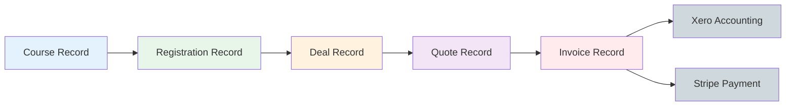

# Courses Module - Data Flow & Automation Logic

**Document Version:** 1.0
**Zoho Instance:** https://crm.zoho.com.au/crm/org7003757385
**Last Updated:** 20 November 2025
**Module:** Courses (137 fields, 37 workflows)

---

## Document Purpose

This document defines:
1. **Minimum Viable Course (MVC)** - Fields required before automation triggers
2. **Trigger Chains** - Full operational impact of each workflow
3. **Registration → Finance Bridge** - How course data flows to invoicing
4. **Compliance & Risk** - PII, retention, and audit requirements
5. **Human Gates** - Where automation stops and manual intervention is required

**Related Documentation:**
- [courses-workflow-urls.md](./courses-workflow-urls.md) - Complete workflow reference with clickable URLs
- [courses-kanban-usage.md](./courses-kanban-usage.md) - Stage-by-stage operational guide
- [courses-stages-comparison.md](./courses-stages-comparison.md) - CRM vs operational stage mapping
- [../diagrams/*.mmd](../diagrams/) - Visual workflow diagrams

---

## Business Logic Rules

### Course Operational Principles

**Courses are operational objects, NOT financial:**
- Courses exist independently of sales/deals
- Courses are created from templates (not cloned)
- Automation triggers ONLY after Minimum Viable Course (MVC) fields are populated
- **Registration Records**, not Courses, trigger financial events

**Financial Sync Rules:**
- Invoice updates do NOT auto-sync on course field changes
- Finance team manually edits invoices
- **ONLY status changes trigger external sync** (Xero, Stripe)
- Edits without status change = NO sync

**Operational Requirements:**
All course automation MUST include:
- Trainer task management
- WorkDrive folder creation
- Attendance and Trainer PDFs
- SMS/email notifications
- WorkDrive calendar sync
- Registration record dependencies

---

## 1. Minimum Viable Course (MVC)

### Field Groups Required Before Automation

**⚠️ Automation is DISABLED until MVC is complete.**

#### Stage 1: Draft → MVC Fields

| Field Category | Fields | Status | Triggers Automation |
|----------------|--------|--------|---------------------|
| **Identity** | Name | **REQUIRED** | Creates Course_ID (WF: 52330000002444506) |
| **Core Details** | Course_Qualification (lookup → Products) | **REQUIRED** | Populates from template (WF: 52330000002638166) |
| **Scheduling** | Course_Start_Time, Course_End_Time | **REQUIRED** | Enables time-based workflows |
| **Instructor** | Course_Trainer (lookup → Contacts) | **REQUIRED** | Enables trainer notifications |
| **Location** | Select_Venue (lookup → Venues) | **REQUIRED** | Populates venue details |
| **Capacity** | Minimum_registrations, Maximum_registrations | **REQUIRED** | Enables registration checks |
| **Pricing** | Fees | **REQUIRED** | Enables invoice creation |
| **Type** | Course_Type (Public/Private) | **REQUIRED** | Determines WordPress sync |

**MVC Validation:**
```
IF all above fields populated THEN
  ✅ Full automation enabled
  ✅ WordPress sync possible
  ✅ Time-based workflows scheduled
  ✅ Trainer notifications enabled
ELSE
  ❌ Automation-disabled until complete
  ❌ Manual completion required
END IF
```

#### Post-MVC: Optional Fields (Enable Advanced Features)

| Field | Purpose | Enables |
|-------|---------|---------|
| Course_Confirmed | Manual viability gate | WordPress calendar publication (WF: 52330000011998036) |
| Private_Course_Client | Private course client | Private course workflows (3 WFs) |
| Flight_to_be_booked, Accommodation_Required | Logistics tracking | Trainer logistics reminders |
| Workdrive_URL | Document storage | Populated automatically by WF: 52330000002462001 |
| WP_Course_ID | WordPress ID | Populated automatically by WF: 52330000006315389 |

---

## 2. Trigger Chains (Full Operational Impact)

### Legend
- **PII:** LOW (no sensitive data) | MEDIUM (email/phone) | HIGH (full contact details)
- **External:** WordPress (WP), WorkDrive (WD), ClickSend SMS, Xero, Stripe
- **Risk:** Low (read-only) | Med (updates records) | High (deletes/financial)

---

### 2.1 ON CREATE Workflows (5 workflows fire immediately)

#### WF: 52330000002444506 - Update Course ID

| Property | Value |
|----------|-------|
| **Trigger** | Course record created |
| **Condition** | None (always fires) |
| **Action** | Assigns unique CRM_Course_ID using formula |
| **Downstream Impact** | - Updates Course.CRM_Course_ID field<br>- No external dependencies |
| **Human Gate** | None - fully automatic |
| **External Dependencies** | None |
| **Compliance** | PII: NONE / Retention: 7 years (RTO requirement) / Audit: YES / Risk: Low |

**URL:** [Open Workflow](https://crm.zoho.com.au/crm/org7003757385/settings/workflow-rules/52330000002444506)

---

#### WF: 52330000002661635 - Create Tasks for Course

| Property | Value |
|----------|-------|
| **Trigger** | Course record created |
| **Condition** | None (always fires) |
| **Action** | Creates Team_Tasks records for course preparation |
| **Downstream Impact** | - Creates 1+ records in Team_Tasks module<br>- Assigns tasks to training coordinator<br>- Sets due dates based on Course_Start_Time |
| **Human Gate** | **REQUIRED:** Staff must complete tasks manually |
| **External Dependencies** | None |
| **Compliance** | PII: LOW (staff names only) / Retention: Until course completion / Audit: NO / Risk: Low |

**URL:** [Open Workflow](https://crm.zoho.com.au/crm/org7003757385/settings/workflow-rules/52330000002661635)

---

#### WF: 52330000004013116 - Naming Convention - Course

| Property | Value |
|----------|-------|
| **Trigger** | Course created OR edited |
| **Condition** | Any field update |
| **Action** | Formats Name field: `[Code] - [Qualification] - [Location] - [Date]` |
| **Downstream Impact** | - Updates Course.Name field<br>- Propagates to Registration_Records.Course lookup display<br>- Visible in Deals, Invoices, Quotes |
| **Human Gate** | None - overrides manual naming |
| **External Dependencies** | None |
| **Compliance** | PII: NONE / Retention: 7 years / Audit: NO / Risk: Low |

**URL:** [Open Workflow](https://crm.zoho.com.au/crm/org7003757385/settings/workflow-rules/52330000004013116)

---

#### WF: 52330000002462001 - Courses_ZohoFlow_CRM Course to Workdrive Folder

| Property | Value |
|----------|-------|
| **Trigger** | Course record created |
| **Condition** | None (always fires) |
| **Action** | Calls Zoho Flow to create folder structure in WorkDrive |
| **Downstream Impact** | - Creates `/Courses/{Course_Name}/` folder in WorkDrive<br>- Stores URL in Course.Workdrive_URL field<br>- Grants access to trainer and admin<br>- Creates subfolders: Attendance, Materials, Certificates |
| **Human Gate** | **REQUIRED:** Staff must upload documents to WorkDrive manually |
| **External Dependencies** | **WorkDrive API** - If WorkDrive down, folder not created |
| **Compliance** | PII: HIGH (student records stored) / Retention: 7 years (AU RTO) / Audit: YES / Risk: Med / External Location: AU (WorkDrive AU region) |

**URL:** [Open Workflow](https://crm.zoho.com.au/crm/org7003757385/settings/workflow-rules/52330000002462001)

**Security Notes:**
- WorkDrive folders inherit organization-level encryption
- Access controlled via Zoho IAM roles
- Deletion of course does NOT delete WorkDrive folder (manual cleanup required)

---

#### WF: 52330000008928362 - Course Performance Record

| Property | Value |
|----------|-------|
| **Trigger** | Course record created |
| **Condition** | None (always fires) |
| **Action** | Initializes Course_Performance analytics record |
| **Downstream Impact** | - Creates 1 record in Course_Performance module<br>- Links to Course via lookup<br>- Initializes metrics: revenue, registrations, completion_rate |
| **Human Gate** | None - metrics update automatically |
| **External Dependencies** | None |
| **Compliance** | PII: NONE (aggregated metrics only) / Retention: Indefinite / Audit: NO / Risk: Low |

**URL:** [Open Workflow](https://crm.zoho.com.au/crm/org7003757385/settings/workflow-rules/52330000008928362)

---

### 2.2 ON FIELD UPDATE Workflows

#### WF: 52330000006315389 - Sync Course to WordPress

| Property | Value |
|----------|-------|
| **Trigger** | Course_Status changed to "Sync to Wordpress" |
| **Condition** | Course_Status == "Sync to Wordpress" AND Course_Type == "Public" |
| **Action** | Publishes course to WordPress website via webhook |
| **Downstream Impact** | - Creates WordPress post (course listing)<br>- Stores WP_Course_ID in CRM<br>- Updates Event_URL with public link<br>- Makes course visible on website calendar |
| **Human Gate** | **REQUIRED:** User must manually set Course_Status to "Sync to Wordpress" |
| **External Dependencies** | **WordPress API** - If WordPress down, sync fails silently |
| **Compliance** | PII: MEDIUM (course details, trainer name) / Retention: 7 years (CRM), indefinite (WordPress) / Audit: YES / Risk: Med / External Location: AU (WordPress hosted AU) |

**URL:** [Open Workflow](https://crm.zoho.com.au/crm/org7003757385/settings/workflow-rules/52330000006315389)

**Error Handling:**
- If WordPress sync fails: WP_Course_ID remains blank, manual retry required
- Private courses: Workflow does NOT fire (Course_Type != "Public" condition prevents)

---

#### WF: 52330000011998036 - Course Confirmed - Website Calendar

| Property | Value |
|----------|-------|
| **Trigger** | Course_Confirmed field set to TRUE |
| **Condition** | Course_Confirmed == true AND WP_Course_ID is populated |
| **Action** | Adds course to WordPress public calendar |
| **Downstream Impact** | - Updates WordPress post metadata<br>- Makes course visible on public calendar<br>- Enables online bookings |
| **Human Gate** | **REQUIRED:** Training coordinator must verify minimum registrations before setting Course_Confirmed = true |
| **External Dependencies** | **WordPress API** |
| **Compliance** | PII: MEDIUM / Retention: 7 years / Audit: YES / Risk: Med / External Location: AU |

**URL:** [Open Workflow](https://crm.zoho.com.au/crm/org7003757385/settings/workflow-rules/52330000011998036)

**Business Rule:**
- Course_Confirmed should only be set to true when Registrations_Booked >= Minimum_registrations
- NO automated enforcement - relies on human judgment

---

#### WF: 52330000003999102 - Update Registration Records (Manual Trigger)

| Property | Value |
|----------|-------|
| **Trigger** | Update_Registration_Records checkbox set to TRUE |
| **Condition** | Update_Registration_Records == true |
| **Action** | Syncs course field changes to ALL linked Registration_Records |
| **Downstream Impact** | - Updates registration Start_Date, End_Date, Venue, Fees<br>- Triggers downstream workflows in Registration_Records module<br>- May trigger invoice recalculations (if not yet paid) |
| **Human Gate** | **REQUIRED:** User must manually check box to trigger sync |
| **External Dependencies** | Registration_Records module workflows |
| **Compliance** | PII: HIGH (updates student registration data) / Retention: 7 years / Audit: YES / Risk: High (financial impact) |

**URL:** [Open Workflow](https://crm.zoho.com.au/crm/org7003757385/settings/workflow-rules/52330000003999102)

**⚠️ WARNING:**
- Changes to course dates/fees propagate to registrations
- If invoices already sent, this does NOT auto-update invoices (finance must manually edit)
- Use only when course details change significantly

---

### 2.3 TIME-BASED Workflows (10 workflows)

#### WF: 52330000003463406 - Check Min Registration

| Property | Value |
|----------|-------|
| **Trigger** | 14 days before Course_Start_Time |
| **Condition** | Registrations_Booked < Minimum_registrations |
| **Action** | Sends alert email to training coordinator |
| **Downstream Impact** | - Email notification only<br>- Does NOT auto-cancel course<br>- Human decision required |
| **Human Gate** | **REQUIRED:** Coordinator must decide: cancel course OR extend registration period |
| **External Dependencies** | Email delivery |
| **Compliance** | PII: LOW (course name, registration count) / Retention: Email logs 90 days / Audit: NO / Risk: Low |

**URL:** [Open Workflow](https://crm.zoho.com.au/crm/org7003757385/settings/workflow-rules/52330000003463406)

---

#### WF: 52330000002656676 - 10 Days Before Course SMS to Trainer

| Property | Value |
|----------|-------|
| **Trigger** | 10 days before Course_Start_Time |
| **Condition** | Course_Trainer is populated AND Course_Trainer.Mobile is populated |
| **Action** | Sends SMS reminder via ClickSend |
| **Downstream Impact** | - SMS sent to trainer's mobile<br>- No CRM record update |
| **Human Gate** | None - fully automatic |
| **External Dependencies** | **ClickSend SMS API** - If down, SMS not sent (no retry) |
| **Compliance** | PII: MEDIUM (mobile number, trainer name) / Retention: ClickSend logs 90 days / Audit: NO / Risk: Low / External Location: AU/US transit |

**URL:** [Open Workflow](https://crm.zoho.com.au/crm/org7003757385/settings/workflow-rules/52330000002656676)

**SMS Content Example:**
```
Hi {Trainer_Name}, reminder: You're delivering {Course_Name} in 10 days.
Start: {Course_Start_Time}. Venue: {Venue_Name}.
Contact coordinator if questions.
```

---

#### WF: 52330000010838346 - Trainer Info PDF

| Property | Value |
|----------|-------|
| **Trigger** | 3 days before Course_Start_Time |
| **Condition** | Course_Trainer is populated |
| **Action** | Generates PDF with course logistics and emails to trainer |
| **Downstream Impact** | - Creates PDF document<br>- Stores in WorkDrive (if configured)<br>- Emails to trainer<br>- Updates last_email_sent timestamp |
| **Human Gate** | None - fully automatic |
| **External Dependencies** | Email, PDF generation, WorkDrive |
| **Compliance** | PII: HIGH (student names, addresses if private course) / Retention: 7 years (WorkDrive) / Audit: YES / Risk: Med / External Location: AU |

**URL:** [Open Workflow](https://crm.zoho.com.au/crm/org7003757385/settings/workflow-rules/52330000010838346)

**PDF Contents:**
- Course details (name, dates, venue)
- Attendee list with names (NO email/phone for privacy)
- Materials checklist
- Venue map and parking info
- Emergency contacts

---

#### WF: 52330000012545268 - 1 Day Prior Attendance PDF

| Property | Value |
|----------|-------|
| **Trigger** | 1 day before Course_Start_Time |
| **Condition** | Registrations_Confirmed > 0 |
| **Action** | Generates attendance sheet PDF |
| **Downstream Impact** | - Creates PDF with student names<br>- Stores in WorkDrive/Courses/{Course_Name}/Attendance/<br>- Emails to trainer |
| **Human Gate** | None - fully automatic (manual trigger also available via WF: 52330000004815267) |
| **External Dependencies** | PDF generation, WorkDrive, Email |
| **Compliance** | PII: HIGH (student full names, signatures collected) / Retention: 7 years (AU RTO requirement) / Audit: YES / Risk: Med / External Location: AU |

**URL:** [Open Workflow](https://crm.zoho.com.au/crm/org7003757385/settings/workflow-rules/52330000012545268)

---

#### WF: 52330000002656789 - Trainer Feedback Email

| Property | Value |
|----------|-------|
| **Trigger** | After Course_End_Time (same day as course ends) |
| **Condition** | Course_Status == "Published" OR "Completed" |
| **Action** | Sends feedback request email to trainer |
| **Downstream Impact** | - Email notification only<br>- Trainer manually enters feedback in CRM |
| **Human Gate** | **REQUIRED:** Trainer must manually enter feedback in Trainer_Comments field |
| **External Dependencies** | Email |
| **Compliance** | PII: LOW / Retention: Email logs 90 days / Audit: NO / Risk: Low |

**URL:** [Open Workflow](https://crm.zoho.com.au/crm/org7003757385/settings/workflow-rules/52330000002656789)

---

#### WF: 52330000002656953 - Trainer Task - Upload Course Material

| Property | Value |
|----------|-------|
| **Trigger** | After Course_End_Time |
| **Condition** | Course_Status == "Completed" |
| **Action** | Creates Team_Task assigned to trainer to upload coursework |
| **Downstream Impact** | - Creates 1 Team_Task record<br>- Assigns to Course_Trainer<br>- Due date: 7 days after course end |
| **Human Gate** | **REQUIRED:** Trainer must upload completed assessments to WorkDrive manually |
| **External Dependencies** | None |
| **Compliance** | PII: LOW / Retention: Until task completed / Audit: NO / Risk: Low |

**URL:** [Open Workflow](https://crm.zoho.com.au/crm/org7003757385/settings/workflow-rules/52330000002656953)

---

### 2.4 MANUAL TRIGGER Workflows (7 workflows)

| Workflow | Trigger Field | Purpose | URL |
|----------|---------------|---------|-----|
| Send Trainer Email | Send_Trainer_email | Emails full logistics to trainer | [52330000002570460](https://crm.zoho.com.au/crm/org7003757385/settings/workflow-rules/52330000002570460) |
| Send to Trainer Calendar | Add_Trainer_Calendar | Creates calendar event for trainer | [52330000011998008](https://crm.zoho.com.au/crm/org7003757385/settings/workflow-rules/52330000011998008) |
| Email to Coordinator | Send_Email_to_Coordinator | Alerts coordinator of course changes | [52330000002582583](https://crm.zoho.com.au/crm/org7003757385/settings/workflow-rules/52330000002582583) |
| Update Registration Records | Update_Registration_Records | Syncs course changes to registrations | [52330000003999102](https://crm.zoho.com.au/crm/org7003757385/settings/workflow-rules/52330000003999102) |
| Create Meetings for Trainer | Create_Meeting_Record | Creates Zoho Meeting records | [52330000003561188](https://crm.zoho.com.au/crm/org7003757385/settings/workflow-rules/52330000003561188) |
| Manual Attendance PDF | Workflow_Actions | Generates attendance PDF on demand | [52330000004569126](https://crm.zoho.com.au/crm/org7003757385/settings/workflow-rules/52330000004569126) |
| Send Attendance to Trainer | Send_Attendance_PDF_to_Trainer | Emails attendance sheet | [52330000004815267](https://crm.zoho.com.au/crm/org7003757385/settings/workflow-rules/52330000004815267) |

**How to Trigger:**
1. Navigate to Course record
2. Find checkbox field (e.g., Send_Trainer_email)
3. Set to TRUE
4. Save record
5. Workflow fires immediately
6. Checkbox auto-resets to FALSE after execution

---

## 3. Registration → Finance Bridge

### 3.1 Data Flow: Courses → Registrations → Deals → Quotes → Invoices



### 3.2 Field Propagation Map

#### Course → Registration_Record

| Course Field | Registration Field | Trigger | Auto/Manual |
|--------------|-------------------|---------|-------------|
| Name | Course (lookup) | On registration create | Auto |
| Course_Start_Time | Start_Date | WF: 52330000002460179 | Auto (when dates change) |
| Course_End_Time | End_Date | WF: 52330000002460179 | Auto (when dates change) |
| Select_Venue | Venue | On create | Auto |
| Fees | Course_Fee | On create | Auto |
| Course_Trainer | Trainer | On create | Auto |

**Workflow:** [Update Registration Course Days](https://crm.zoho.com.au/crm/org7003757385/settings/workflow-rules/52330000002460179)

**⚠️ Important:**
- Changes to course dates automatically update existing registrations
- Changes to course fees do NOT update existing invoices (manual intervention required)

---

#### Registration_Record → Invoice (via Deal)

| Registration Field | Invoice Field | Trigger | Auto/Manual |
|--------------------|---------------|---------|-------------|
| Deal (lookup) | Deal_Name__s (lookup) | Deal → Quote → Invoice flow | Auto |
| Attendee (Contact) | Contact_Name | From Deal | Auto |
| Course_Fee | Line item amount | From Quote | Auto |
| Course (lookup) | Course_Name (lookup) | From Deal | Auto |

**Creation Flow:**
1. Registration created with Deal lookup
2. Deal moves to "Ready to Quote" stage → Creates Quote (WF in Deals module)
3. User converts Quote → Invoice (manual button in Quote record)
4. Invoice inherits course, contact, amount from Quote

**Invoice Creation Rules:**
- Invoices are created FROM Quotes, not directly from Registrations
- Invoice status starts as "Draft"
- Finance team manually reviews before sending

---

### 3.3 Invoice Status → External Sync Rules

**⚠️ CRITICAL: Only status changes trigger external sync. Field edits do NOT sync.**

| Invoice Status | Xero Sync | Stripe Sync | Finance Action |
|----------------|-----------|-------------|----------------|
| Draft | ❌ No sync | ❌ No sync | Finance can edit freely |
| Sent | ❌ No sync | ❌ No sync | Email sent to customer |
| Awaiting Payment | ❌ No sync | ✅ Creates payment intent | Customer can pay online |
| Paid | ✅ Syncs to Xero | ✅ Confirms payment | Updates Deal.Amount |
| Overdue | ❌ No sync | ❌ No sync | Reminder emails sent |
| Void | ✅ Voids in Xero | ✅ Cancels payment intent | - |

**Workflows:**
- **Push Invoice to Xero:** [52330000002460231](https://crm.zoho.com.au/crm/org7003757385/settings/workflow-rules/52330000002460231) - Fires when Status → "Paid"
- **Update Amount in Deal:** [52330000009085784](https://crm.zoho.com.au/crm/org7003757385/settings/workflow-rules/52330000009085784) - Fires when Status → "Paid"

**Manual Gating Rules:**
1. Finance must manually review invoice before changing status to "Sent"
2. If customer requests changes after "Sent", finance edits invoice WITHOUT changing status
3. ONLY when payment confirmed, finance changes status to "Paid" → triggers Xero sync

---

### 3.4 Registration-Driven Invoice Creation (Public vs Private)

#### Public Course Registration → Invoice

1. Student registers online for course
2. Registration_Record created (auto or manual)
3. Deal auto-created with naming convention: `{Student Name} - {Course Name}`
4. Deal stage set to "Ready to Quote"
5. Quote auto-created from Deal (WF: 52330000002460308 in Deals module)
6. User manually converts Quote → Invoice
7. Invoice created with status "Draft"
8. Finance reviews and sets status to "Sent" or "Awaiting Payment"

**SOP Reference:** Public Invoice (46% automated - see automation_coverage_matrix.md)

---

#### Private Course Registration → Invoice

1. Private course client selected (Private_Course_Client field populated)
2. Registrations created for multiple attendees
3. ONE Deal created per private course booking (not per attendee)
4. Quote line items = sum of all attendee registrations
5. Quote manually created by staff (not auto-generated)
6. Invoice created from Quote
7. Invoice sent to Private_Course_Client billing contact

**SOP Reference:** Private Attendee Invoicing (29% automated)

**Key Difference:**
- Public: 1 invoice per registration
- Private: 1 invoice covering multiple registrations

---

## 4. Mermaid Diagrams (Visual Reference)

All diagrams located in: `/modules/courses/diagrams/`

### Available Diagrams

| Diagram | Description | File |
|---------|-------------|------|
| Full Workflow Map | All 37 workflows with dependencies | `courses-workflow.mmd` |
| Attendee Journey | Student perspective with 14 workflows | `course-attendees-journey.mmd` |
| Kanban View (Simple) | Stage overview | `courses-kanban-simple.mmd` |
| Kanban View (Detailed) | Full stage breakdown with clickable links | `courses-kanban-detailed.mmd` |
| Registration Timeline | Gantt-style view of course lifecycle | `registration-timeline.mmd` |

**All diagrams include clickable workflow URLs** - Click workflow nodes to open in Zoho CRM.

**Example:** See [courses-workflow-urls.md](./courses-workflow-urls.md) for formatted diagrams with active links.

---

## 5. Complete Trigger Table

| Workflow Name | ID | Trigger | Condition | Action | External | Human Gate | PII | Risk |
|---------------|-----|---------|-----------|--------|----------|------------|-----|------|
| Udpate Course ID | 52330000002444506 | create | Always | Assigns CRM_Course_ID | None | ❌ | NONE | Low |
| Create Tasks for Course | 52330000002661635 | create | Always | Creates Team_Tasks | None | ✅ Staff completes tasks | LOW | Low |
| Naming Convention | 52330000004013116 | create_or_edit | Always | Formats course name | None | ❌ | NONE | Low |
| Workdrive Folder | 52330000002462001 | create | Always | Creates folder | WorkDrive | ✅ Upload docs | HIGH | Med |
| Course Performance Record | 52330000008928362 | create | Always | Creates analytics | None | ❌ | NONE | Low |
| Sync to WordPress | 52330000006315389 | Course_Status | "Sync to Wordpress" | Publishes course | WordPress | ✅ Set status | MED | Med |
| Course Confirmed | 52330000011998036 | Course_Confirmed | == true | Adds to calendar | WordPress | ✅ Verify min reg | MED | Med |
| Update Registrations | 52330000003999102 | Update_Registration_Records | == true | Syncs to regs | None | ✅ Check box | HIGH | High |
| Check Min Registration | 52330000003463406 | 14 days before start | Regs < Min | Email alert | Email | ✅ Decide cancel | LOW | Low |
| 10 Day SMS | 52330000002656676 | 10 days before | Trainer populated | SMS reminder | ClickSend | ❌ | MED | Low |
| Trainer Info PDF | 52330000010838346 | 3 days before | Trainer populated | Sends PDF | Email, WD | ❌ | HIGH | Med |
| 1 Day SMS | 52330000002656692 | 1 day before | Trainer populated | SMS reminder | ClickSend | ❌ | MED | Low |
| Attendance PDF | 52330000012545268 | 1 day before | Regs > 0 | Creates PDF | Email, WD | ❌ | HIGH | Med |
| Trainer Feedback | 52330000002656789 | After course end | Status Published/Completed | Email request | Email | ✅ Enter feedback | LOW | Low |
| Upload Material Task | 52330000002656953 | After course end | Status Completed | Creates task | None | ✅ Upload files | LOW | Low |
| Send Trainer Email | 52330000002570460 | Send_Trainer_email | == true | Emails logistics | Email | ✅ Check box | MED | Low |
| Trainer Calendar | 52330000011998008 | Add_Trainer_Calendar | == true | Creates event | Calendar | ✅ Check box | MED | Low |
| Email Coordinator | 52330000002582583 | Send_Email_to_Coordinator | == true | Emails staff | Email | ✅ Check box | LOW | Low |
| Create Meetings | 52330000003561188 | Create_Meeting_Record | == true | Creates meetings | Meetings | ✅ Check box | MED | Low |
| Manual Attendance | 52330000004569126 | Workflow_Actions | Field set | Creates PDF | Email, WD | ✅ Trigger field | HIGH | Med |
| Send Attendance | 52330000004815267 | Send_Attendance_PDF_to_Trainer | == true | Emails PDF | Email | ✅ Check box | HIGH | Med |
| Cancelled Course | 52330000003995688 | Course_Status | "Cancelled" | Notifies stakeholders | Email | ✅ Set status | MED | Med |
| Archive/Cancel Notify | 52330000011362374 | Course_Status | "Archived"/"Cancelled" | Notifies | Email | ✅ Set status | LOW | Low |
| Status Completed | 52330000004037507 | Course_Status | "Completed" | Post-completion | None | ✅ Set status | LOW | Low |
| Course Performance | 52330000008928375 | Course_Status | "Completed" | Updates analytics | None | ❌ | NONE | Low |
| Completed WP Sync | 52330000004065214 | 1 week after start | Always | Marks complete | WordPress | ❌ | MED | Low |

**See [courses-workflow-urls.md](./courses-workflow-urls.md) for complete workflow details with URLs.**

---

## 6. Legal & Sensitivity Tags

### 6.1 PII Field Inventory

| Field | PII Level | Data Type | Retention | Justification |
|-------|-----------|-----------|-----------|---------------|
| Name | LOW | Text | 7 years | Public course info |
| Course_Trainer (lookup) | MEDIUM | Contact ID | 7 years | Contains trainer email/phone |
| Private_Course_Client | MEDIUM | Account ID | 7 years | Contains billing contact details |
| Workdrive_URL | HIGH | URL | 7 years | Links to folder with student records |
| Trainer_Comments | LOW | Text | 7 years | No student PII |
| Event_URL | NONE | URL | 7 years | Public website link |

---

### 6.2 Integration Security & Data Flow

#### WordPress Integration

| Property | Value |
|----------|-------|
| **Fields Exposed** | Name, Course_Start_Time, Venue, Fees, Course_Type |
| **PII Level** | MEDIUM (trainer name visible publicly) |
| **Data Location** | Australia (WordPress hosted in AU) |
| **Retention** | Indefinite (posts remain until manually deleted) |
| **Access Control** | Public website (anyone can view) |
| **Encryption** | HTTPS in transit, no at-rest encryption |
| **Audit Trail** | WordPress logs HTTP requests (90 days) |
| **Risk** | **Medium** - Public exposure of course details |
| **Compliance** | No GDPR deletion flow (must manually delete WP post) |

**Workflows:** 52330000006315389, 52330000011998036, 52330000004065214

---

#### WorkDrive Integration

| Property | Value |
|----------|-------|
| **Data Stored** | Attendance sheets, trainer PDFs, student assessments, certificates |
| **PII Level** | HIGH (full student names, signatures, assessment results) |
| **Data Location** | Australia (WorkDrive AU region) |
| **Retention** | 7 years (Australian RTO requirement) |
| **Access Control** | Zoho IAM roles (admin, trainer, coordinator) |
| **Encryption** | AES-256 at rest, TLS 1.2 in transit |
| **Audit Trail** | YES - WorkDrive logs all file access |
| **Risk** | **High** - Contains sensitive student records |
| **Compliance** | Meets Australian Privacy Principles (APP) |

**Workflows:** 52330000002462001, 52330000010838346, 52330000012545268

**Security Practices:**
- WorkDrive folders created with restricted access (trainer + admin only)
- Student PII in PDFs is NOT encrypted within PDF (relies on WorkDrive encryption)
- Deletion of course in CRM does NOT delete WorkDrive folder (manual cleanup required)
- Retention: Folders must be manually deleted after 7 years

---

#### ClickSend SMS Integration

| Property | Value |
|----------|-------|
| **Data Transmitted** | Trainer mobile number, course name, dates, venue |
| **PII Level** | MEDIUM (mobile number, trainer name) |
| **Data Location** | US/Australia transit (ClickSend routes via US servers) |
| **Retention** | 90 days (ClickSend logs) |
| **Access Control** | ClickSend API key (stored in Zoho Secrets) |
| **Encryption** | TLS 1.2 in transit, no at-rest encryption |
| **Audit Trail** | NO (ClickSend does not provide audit logs to clients) |
| **Risk** | **Medium** - Trainer mobile numbers exposed in transit |
| **Compliance** | US transit may violate strict GDPR (not applicable for AU) |

**Workflows:** 52330000002656676, 52330000002656692

**Security Practices:**
- API key stored in Zoho Secrets (NOT in CRM fields)
- SMS sent only if trainer has opted in (assumed via Contact.Mobile populated)
- No opt-out mechanism automated (trainers must contact admin)

---

#### Xero Integration (Invoices Module)

| Property | Value |
|----------|-------|
| **Data Synced** | Invoice amount, course name, contact name, payment status |
| **PII Level** | HIGH (billing contact email, address) |
| **Data Location** | Australia (Xero AU instance) |
| **Retention** | 7 years (Australian tax law) |
| **Access Control** | OAuth 2.0 (admin-level access) |
| **Encryption** | TLS 1.3 in transit, Xero encryption at rest |
| **Audit Trail** | YES - Xero logs all API calls |
| **Risk** | **High** - Financial data exposure |
| **Compliance** | Meets AU tax and privacy requirements |

**Workflow:** 52330000002460231 (in Invoices module)

**Sync Rules:**
- ONLY invoice status change triggers Xero sync (field edits do NOT sync)
- Invoice edits require manual Xero update by accountant
- No automated delete/void sync (manual intervention required)

---

#### Stripe Integration (Invoices Module)

| Property | Value |
|----------|-------|
| **Data Synced** | Payment intent, customer email, amount |
| **PII Level** | HIGH (email, payment details tokenized) |
| **Data Location** | US/Australia (Stripe processes in US, stores tokenized in AU) |
| **Retention** | 7 years (Stripe retains payment records) |
| **Access Control** | Stripe API key (restricted publishable key) |
| **Encryption** | TLS 1.3, PCI DSS Level 1 compliant |
| **Audit Trail** | YES - Stripe Sigma for audit queries |
| **Risk** | **High** - Payment card data (tokenized) |
| **Compliance** | PCI DSS compliant, GDPR compliant (Stripe DPA in place) |

**Workflow:** Triggered by Invoice status change (exact WF ID not documented in Courses module)

**Security Practices:**
- Stripe API secret key stored in Zoho Secrets
- Customer payment details NEVER stored in CRM (Stripe tokenizes)
- Webhook signature verification enabled
- 3D Secure enforced for AU cards

---

### 6.3 Data Retention & Deletion

| Module | Retention Period | Deletion Trigger | Cascade Impact |
|--------|------------------|------------------|----------------|
| Courses | 7 years after course end | Manual archive after 7 years | Does NOT delete WorkDrive folder |
| Team_Tasks | Until course completed | Deleted 90 days after completion | None |
| Course_Performance | Indefinite | Never deleted (analytics) | None |
| Registration_Records | 7 years | Deleted with course (cascades) | ⚠️ Orphans invoices if not handled |
| Invoices | 7 years | Manual delete by finance | Xero record remains (must manually void) |
| WorkDrive Folders | 7 years | **MANUAL CLEANUP REQUIRED** | ⚠️ No automated deletion |

**⚠️ Data Retention Gaps:**
1. **WorkDrive:** Folders not auto-deleted when course archived
2. **WordPress:** Posts remain indefinitely unless manually deleted
3. **Xero:** Records must be manually voided (no automated cascade)
4. **ClickSend:** SMS logs retained 90 days (cannot be deleted on demand)

---

### 6.4 Audit Requirements

| Workflow | Audit Level | Log Retention | Compliance Requirement |
|----------|-------------|---------------|------------------------|
| WorkDrive folder creation | **Required** | 7 years | RTO audit trail |
| Attendance PDF generation | **Required** | 7 years | RTO student records |
| Invoice sync to Xero | **Required** | 7 years | Australian tax law (ATO) |
| WordPress sync | Optional | 90 days | Marketing audit |
| SMS reminders | Optional | 90 days | No requirement |

**Audit Trail Tools:**
- **Zoho CRM:** Audit Log (90 days free, indefinite with Enterprise)
- **WorkDrive:** File access logs (indefinite)
- **Xero:** API audit log (7 years)
- **Stripe:** Sigma audit queries (indefinite)
- **ClickSend:** No audit export available

---

## 7. Explicit Notes on Non-Automation Areas

### Where Automation STOPS and Human Intervention is REQUIRED

#### 7.1 Course Viability Decision (Registration Stage)

**Human Gate:** Training Coordinator

**Automation Provides:**
- WF: 52330000003463406 sends alert 14 days before course start if registrations below minimum
- Email notification only

**Human Must:**
1. Review registration numbers vs. historical trends
2. Consider extending registration period vs. cancelling course
3. Manually set Course_Status to "Cancelled" if decision is to cancel
4. Contact registered students (automation does NOT send cancellation emails automatically)
5. Process refunds via Invoices module (no automated refund workflow)

**Why Not Automated:**
- Business judgment required (e.g., extend registration, reduce minimum, merge with another course)
- Financial impact (cancellation costs: trainer cancellation fees, venue deposits)

---

#### 7.2 Invoice Editing After Sent

**Human Gate:** Finance Team (Accountant)

**Automation Provides:**
- Invoice auto-created from Quote
- Status change triggers Xero sync

**Human Must:**
1. Manually review invoice before setting status to "Sent"
2. If customer requests changes AFTER invoice sent:
   - Edit invoice fields manually (amount, line items, dates)
   - Do NOT change status (to avoid triggering Xero sync)
3. ONLY change status to "Paid" when payment confirmed
4. Manually reconcile Xero if invoice edited after sync

**Why Not Automated:**
- Finance team needs full control over invoice accuracy
- Xero sync is one-way (edits in CRM do NOT push to Xero unless status changes)
- Prevents accidental overwrites in Xero

---

#### 7.3 Certificate Processing

**Human Gate:** RTO Coordinator

**Automation Provides:**
- WF: 52330000002656953 creates task reminder for trainer to upload coursework
- Task assigned to trainer

**Human Must:**
1. Review uploaded coursework in WorkDrive
2. Verify competency assessments complete
3. Submit to RTO for certificate generation
4. Download certificates from RTO portal
5. Upload certificates to WorkDrive
6. Email certificates to students (manual email, not automated)
7. Update Registration_Record.Certificate_Issued field

**Why Not Automated:**
- RTO certification is external process (no API integration)
- Human QA required for assessment accuracy
- Legal requirement for authorized signatory

---

#### 7.4 Private Course Pricing Negotiation

**Human Gate:** Sales Team

**Automation Provides:**
- Private course workflows update status
- Naming conventions applied

**Human Must:**
1. Negotiate custom pricing with Private_Course_Client
2. Manually create Quote with negotiated line items
3. Apply discounts/surcharges as needed
4. Get client approval before converting to Invoice

**Why Not Automated:**
- Pricing varies based on group size, customization, location
- Requires human negotiation and judgment
- Cannot template complex pricing structures

---

#### 7.5 WorkDrive Document Management

**Human Gate:** Training Coordinator, Trainer

**Automation Provides:**
- WF: 52330000002462001 creates folder structure
- PDFs auto-generated and stored

**Human Must:**
1. Upload course materials (pre-course resources)
2. Upload completed assessments (trainer uploads)
3. Upload certificates (after RTO processing)
4. Organize documents into subfolders
5. Set permissions for trainer access
6. Archive folder after 7 years (manual deletion)

**Why Not Automated:**
- Document upload requires human curation (which files to include)
- Assessment review requires human QA
- Permissions vary by course type (public vs. private)

---

#### 7.6 Trainer Logistics Booking

**Human Gate:** Training Coordinator

**Automation Provides:**
- Time-based SMS reminders
- Email logistics details

**Human Must:**
1. Book trainer flights (if Flight_to_be_booked == true)
2. Book accommodation (if Accommodation_Required == true)
3. Arrange hire car (if Hire_Car_Required == true)
4. Confirm bookings with trainer
5. Update booking reference numbers in Course record

**Why Not Automated:**
- Travel booking requires human negotiation (cheapest fares, trainer preferences)
- External systems (flight booking portals) have no API integration
- Cancellations/changes require human decision-making

---

#### 7.7 Course Cancellation Refunds

**Human Gate:** Finance Team

**Automation Provides:**
- WF: 52330000003995688 sends cancellation notification

**Human Must:**
1. Identify all paid invoices for cancelled course
2. Manually void invoices in CRM
3. Process refunds via Stripe/Xero
4. Confirm refunds with students
5. Update Invoice.Status to "Void"

**Why Not Automated:**
- Refund amount may differ from invoice amount (restocking fees, partial refunds)
- Payment method varies (credit card, bank transfer, credit note)
- Requires human approval for financial control

---

### Summary: Automation Coverage

| Process Area | Automation Level | Human Gate Required |
|---------------|------------------|---------------------|
| Course creation | 80% automated | Minimal (populate MVC fields) |
| WordPress sync | 90% automated | Set status to "Sync to Wordpress" |
| Trainer notifications | 95% automated | None (time-based) |
| Registration management | 50% automated | Monitor registrations, decide viability |
| Invoice creation | 70% automated | Finance review before send |
| Invoice payment sync | 90% automated | Set status to "Paid" |
| Certificate processing | 10% automated | Full human process (RTO) |
| Logistics booking | 0% automated | Full manual process |
| Cancellation refunds | 30% automated | Finance processes refunds |

**Overall SOP Automation: 31%** (per automation_coverage_matrix.md)

**Highest Human Burden:**
- Registration Process: 80% manual
- Deal Pipeline Management: 67% manual
- Private Attendee Invoicing: 71% manual

---

## 8. Workflow Sequencing & Dependencies

### Critical Path: Course Creation → Delivery

```
1. Course Created
   ↓ (5 workflows fire immediately)
2. MVC Fields Populated
   ↓ (Human: populate all MVC fields)
3. Status → "Sync to Wordpress"
   ↓ (WF: 52330000006315389 syncs)
4. Status → "Published"
   ↓ (Registrations begin, 10 time-based workflows scheduled)
5. 14 Days Before: Minimum registration check
   ↓ (Human: decide cancel or proceed)
6. 11 Days Before: Attendance app sent
7. 10 Days Before: SMS to trainer
8. 3 Days Before: Trainer info PDF
9. 1 Day Before: Attendance PDF + SMS
   ↓ (Course delivered)
10. Same Day: Trainer feedback email
11. Status → "Completed"
   ↓ (WF: 52330000004037507, 52330000008928375 fire)
12. After Course: Upload material task
13. Status → "Archived"
   ↓ (Course lifecycle complete)
```

**Dependency Warnings:**
- If Course_Start_Time not populated: All time-based workflows do NOT schedule
- If Course_Trainer not populated: Trainer emails/SMS do NOT send (silent failure)
- If Course_Type != "Public": WordPress sync does NOT fire

---

## Document Maintenance

**Last Updated:** 2025-11-20
**Next Review:** 2026-02-01 (quarterly review)
**Owner:** Training Operations Team

**Change Log:**
- 2025-11-20: Initial version created
- TBD: Add field catalog reference when courses-fields.md created
- TBD: Add detailed workflow logic when courses-workflows.md created

**Related Documentation:**
- [courses-workflow-urls.md](./courses-workflow-urls.md)
- [courses-kanban-usage.md](./courses-kanban-usage.md)
- [courses-stages-comparison.md](./courses-stages-comparison.md)
- [../diagrams/*.mmd](../diagrams/)
- [/docs/DOCUMENTATION_EXPLORATION_REPORT.md](../../../docs/DOCUMENTATION_EXPLORATION_REPORT.md)
- [/docs/DATA-FLOW-DOCUMENTATION-ROADMAP.md](../../../docs/DATA-FLOW-DOCUMENTATION-ROADMAP.md)

---

**End of Document**
