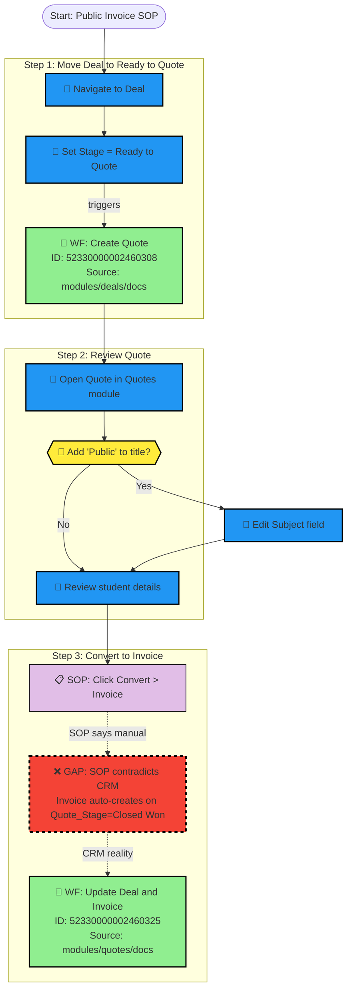

# Final Refined Plan: SOP-to-CRM Cross-Check System

## Architecture Model

```
┌─────────────────────────────────────────────────────────────┐
│                    RECONCILIATION LAYER                      │
│                  SOPs/processed_sops/                         │
│   (New outputs only - annotated SOPs, enhanced diagrams,     │
│    mappings, gap analysis)                                   │
└─────────────────────────────────────────────────────────────┘
                            ▲
              ┌─────────────┴─────────────┐
              │                           │
┌─────────────▼─────────────┐ ┌───────────▼───────────────────┐
│   HUMAN PROCEDURES        │ │   CRM SOURCE OF TRUTH         │
│   SOPs/raw_sops/          │ │   modules/* and docs/*        │
│                           │ │                               │
│ • public_invoice_sop.md   │ │ • API-extracted workflows     │
│ • private_attendee_*.md   │ │ • Field definitions           │
│ • deal_pipeline_*.md      │ │ • Mermaid diagrams            │
│ • quoting_process_*.md    │ │ • Dependency mappings         │
│ • registration_process.md │ │ • Status maps                 │
│                           │ │                               │
│ READ ONLY (input)         │ │ READ ONLY (source of truth)   │
└───────────────────────────┘ └───────────────────────────────┘
```

**Core Principle:** The `processed_sops/` folder contains ONLY new generated assets. It references but never modifies the source layers.

---

## Final Directory Structure

```
SOPs/
├── raw_sops/                              # UNCHANGED - Human SOPs (input)
│   ├── public_invoice_sop.md
│   ├── private_attendee_invoicing_sop.md
│   ├── deal_pipeline_management.md
│   ├── quoting_process_private_student.md
│   └── registration_process.md
│
└── processed_sops/                        # NEW - All outputs here
    │
    ├── README.md                          # Overview and usage guide
    │
    ├── analysis/
    │   ├── sop_workflow_mapping.md        # Master mapping: SOP steps → workflow IDs
    │   ├── gap_analysis_report.md         # All identified gaps with severity
    │   ├── automation_coverage_matrix.md  # % coverage per SOP
    │   └── source_references.md           # Links to all referenced source files
    │
    ├── annotated_sops/
    │   ├── public_invoice_annotated.md
    │   ├── private_attendee_annotated.md
    │   ├── deal_pipeline_annotated.md
    │   ├── quoting_process_annotated.md
    │   └── registration_process_annotated.md
    │
    ├── diagrams/
    │   ├── public_invoice_flow.mmd        # Enhanced diagram with decision nodes
    │   ├── private_attendee_flow.mmd
    │   ├── deal_pipeline_flow.mmd
    │   ├── quoting_process_flow.mmd
    │   └── registration_process_flow.mmd
    │
    └── reconciliation/
        ├── contradictions.md              # SOP vs CRM conflicts
        ├── missing_automations.md         # Workflows that should exist
        └── sop_update_recommendations.md  # Suggested raw_sops revisions
```

**Total new files: 17**

---

## Source Reference Strategy

Each file in `processed_sops/` will explicitly reference its sources:

```markdown
---
## Source References

**Raw SOP:** `SOPs/raw_sops/public_invoice_sop.md`

**CRM Workflow Sources (READ ONLY):**
- `modules/deals/docs/deal-kanban-usage.md`
- `modules/quotes/docs/quotes-workflows.md`
- `modules/invoices/docs/invoices-workflows.md`

**CRM Diagram Sources (READ ONLY):**
- `modules/deals/diagrams/deals-workflow.mmd`
- `modules/quotes/diagrams/quotes-lifecycle.mmd`
- `modules/invoices/diagrams/invoices-payment-flow.mmd`

**Note:** Source files are not modified. This annotated version adds reconciliation layer.
---
```

---

## Execution Steps

### Phase 1: Setup & Source Indexing

**Step 1.1:** Create folder structure
```
mkdir -p SOPs/processed_sops/{analysis,annotated_sops,diagrams,reconciliation}
```

**Step 1.2:** Create `source_references.md`
- Index all files in `modules/*/docs/` and `modules/*/diagrams/`
- Index all workflow IDs and their locations
- Create quick-lookup table for implementation

**Deliverable:** `analysis/source_references.md`

---

### Phase 2: SOP Extraction & Classification

**Step 2.1:** For each raw SOP, extract:

| Extraction Type | Method | Output |
|-----------------|--------|--------|
| Manual Actions | Find verbs: Navigate, Click, Set, Fill, Open, Review | Tagged list |
| Decision Points | Find conditionals: If, When, Unless, Optional | Decision inventory |
| Manual Inputs | Find data entry: "Enter", "Fill in", "Add" | Input requirements |
| Assumptions | Find prerequisites: "already created", "from previous" | Dependency list |
| Module Touchpoints | Identify: Deals, Quotes, Invoices, Courses, Contacts | Module mapping |

**Step 2.2:** Create classification JSON for each SOP (internal working file)

**Deliverable:** Internal data structures for Phase 3

---

### Phase 3: Workflow Mapping

**Step 3.1:** For each SOP step, search source files:
- `modules/{module}/docs/*-workflows.md` for workflow IDs
- `modules/{module}/diagrams/*.mmd` for existing visualizations

**Step 3.2:** Build mapping table:

| SOP | Step | Action | Module | Workflow ID | Workflow Name | Trigger | Status |
|-----|------|--------|--------|-------------|---------------|---------|--------|
| public_invoice | 1 | Move to Ready to Quote | Deals | 52330000002460308 | Create Quote | field_update (Stage) | ✅ ALIGNED |
| public_invoice | 3 | Convert Quote to Invoice | Quotes | 52330000002460325 | Update Deal and Invoice on Quote Closed Won | field_update (Quote_Stage) | ❌ CONTRADICTS |

**Step 3.3:** Calculate coverage metrics per SOP

**Deliverable:** `analysis/sop_workflow_mapping.md`

---

### Phase 4: Gap Analysis

**Step 4.1:** Classify each mapping as:

| Code | Status | Meaning | Action |
|------|--------|---------|--------|
| ✅ | ALIGNED | SOP matches CRM automation | Document only |
| ⚠️ | PARTIAL | Automation exists but SOP incomplete | Update SOP recommendation |
| ❌ | CONTRADICTS | SOP says X, CRM does Y | Flag for SOP revision |
| 🔴 | MISSING | Manual step needs automation | Recommend new workflow |
| 🟡 | UNDOCUMENTED | CRM automation not in SOP | Add to SOP |

**Step 4.2:** Document all gaps with:
- Severity (Critical/High/Medium/Low)
- Impact description
- Recommended resolution
- Source file references

**Deliverable:** `analysis/gap_analysis_report.md`

---

### Phase 5: Coverage Matrix

**Step 5.1:** Calculate per-SOP metrics:

```markdown
| SOP | Total Steps | Automated | Manual Required | Gaps | Coverage % |
|-----|-------------|-----------|-----------------|------|------------|
| Public Invoice | 12 | 7 | 3 | 2 | 58% |
| Private Attendee | 10 | 4 | 5 | 1 | 40% |
| Deal Pipeline | 15 | 9 | 4 | 2 | 60% |
| Quoting Process | 11 | 6 | 4 | 1 | 55% |
| Registration | 9 | 5 | 3 | 1 | 56% |
```

**Deliverable:** `analysis/automation_coverage_matrix.md`

---

### Phase 6: Annotated SOPs

**Step 6.1:** For each raw SOP, create annotated version with inline references:

```markdown
# Public Invoice SOP - Annotated

> **Source:** `SOPs/raw_sops/public_invoice_sop.md`
> **CRM Sources:** See [Source References](../analysis/source_references.md)

---

## Step 1: Move Deal Stage to "Ready to Quote"

### Original SOP Instruction
> - Navigate to the relevant Deal (already created from previous SOP).
> - Set the stage to "Ready to Quote".
> - Refresh the screen to allow the system to generate the quote.

### CRM Reality

**🤖 Automation Triggered:**
- **Workflow:** Create Quote - Stage Update Ready to quote
- **ID:** 52330000002460308
- **Source:** `modules/deals/docs/deal-kanban-usage.md:229-246`
- **Action:** Auto-creates Quote record when Stage = "Ready to Quote"

**👤 Human Actions Required:**
1. Navigate to Deal record
2. Change Stage field to "Ready to Quote"
3. Wait for page refresh (quote auto-generates)

**⚠️ Gap Identified:**
- SOP says "Refresh the screen" but doesn't explain Quote appears in Quotes module
- **Recommendation:** Add "Go to Quotes module to find new quote linked to this Deal"

### Decision Points
None at this step.

### Fields Affected
| Field | Module | Update Type | Source |
|-------|--------|-------------|--------|
| Stage | Deals | Manual | User selection |
| Quote record | Quotes | Automatic | Workflow 52330000002460308 |

---
```

**Deliverable:** 5 files in `annotated_sops/`

---

### Phase 7: Enhanced Mermaid Diagrams

**Step 7.1:** Create NEW diagrams (not copies of existing) that show:
- Full SOP flow with decision points
- Workflow references (IDs link to source diagrams)
- Human input nodes
- Gap indicators

**Step 7.2:** Diagram format:



**Key difference from source diagrams:** These diagrams show the SOP journey with gaps highlighted. Source diagrams in `modules/*/diagrams/` show pure CRM workflow logic.

**Deliverable:** 5 files in `diagrams/`

---

### Phase 8: Reconciliation Documents

**Step 8.1:** `contradictions.md`
```markdown
# SOP vs CRM Contradictions

## Summary
Total contradictions found: X

---

## Contradiction #1: Invoice Creation Method

**SOP:** `public_invoice_sop.md` Step 3
> "At the top of the quote page, click 'Convert' > 'Convert to Invoice'"

**CRM Reality:** `modules/quotes/docs/quotes-workflows.md:104-122`
- Workflow `52330000002460325` auto-creates invoice when `Quote_Stage = Closed Won`
- Manual conversion button exists but bypasses workflow tracking

**Impact:** High
- Users may create duplicate invoices
- Workflow fields (Quote_Won_Date, Deal stage update) won't populate

**Resolution:** Update SOP to say "Set Quote_Stage to Closed Won - invoice auto-generates"
```

**Step 8.2:** `missing_automations.md`
- List manual steps that could be automated
- Include business case and suggested trigger

**Step 8.3:** `sop_update_recommendations.md`
- Specific text changes for each raw SOP
- Prioritized by impact

**Deliverable:** 3 files in `reconciliation/`

---

### Phase 9: README & Finalization

**Step 9.1:** Create `processed_sops/README.md`:

```markdown
# Processed SOPs - Reconciliation Layer

## Purpose
This folder contains cross-checked and annotated versions of raw SOPs,
reconciled against CRM-API extracted workflow data.

## Architecture
- **Input 1:** `SOPs/raw_sops/` - Human-written procedures
- **Input 2:** `modules/*` and `docs/*` - CRM source of truth (READ ONLY)
- **Output:** This folder - Reconciliation layer

## Usage
1. Start with `analysis/gap_analysis_report.md` for overview
2. Review individual SOPs in `annotated_sops/`
3. View enhanced diagrams in `diagrams/`
4. Check `reconciliation/` for action items

## Important
Source files in `modules/*` are NOT modified. This layer adds context only.

## File Index
[List all 16 files with descriptions]
```

**Deliverable:** `README.md`

---

## Execution Sequence

| Phase | Deliverables | Dependencies |
|-------|-------------|--------------|
| 1. Setup | Folder structure, `source_references.md` | None |
| 2. Extract | Internal classification data | Phase 1 |
| 3. Map | `sop_workflow_mapping.md` | Phase 2 |
| 4. Gaps | `gap_analysis_report.md` | Phase 3 |
| 5. Matrix | `automation_coverage_matrix.md` | Phase 4 |
| 6. Annotate | 5 annotated SOP files | Phase 3, 4 |
| 7. Diagrams | 5 .mmd diagram files | Phase 6 |
| 8. Reconcile | 3 reconciliation files | Phase 4 |
| 9. Finalize | `README.md` | All phases |

---

## Naming Conventions

| File Type | Pattern | Example |
|-----------|---------|---------|
| Annotated SOP | `{sop_name}_annotated.md` | `public_invoice_annotated.md` |
| Flow Diagram | `{sop_name}_flow.mmd` | `public_invoice_flow.mmd` |
| Analysis Report | `{topic}_report.md` | `gap_analysis_report.md` |

---

## Deliverables Summary

| Deliverable | Count | Description |
|-------------|-------|-------------|
| Annotated SOPs | 5 | Each raw SOP with workflow annotations |
| Flow Diagrams | 5 | Mermaid diagrams with decision nodes |
| Mapping Document | 1 | Master SOP ↔ Workflow mapping |
| Gap Analysis | 1 | Complete gap identification |
| Coverage Matrix | 1 | Automation coverage percentages |
| Contradictions | 1 | SOP vs. CRM conflicts |
| Missing Automations | 1 | Recommended new workflows |
| Update Recommendations | 1 | Suggested SOP revisions |
| Source References | 1 | Index of all source files |
| README | 1 | Overview and usage guide |

**Total: 18 files** in `SOPs/processed_sops/`

---

## Success Criteria

1. **100% SOP coverage** - Every step in every raw SOP has been analyzed
2. **Workflow linkage** - Every relevant automation is referenced with clickable URLs
3. **Gap visibility** - All contradictions and missing automations are documented
4. **Actionable output** - Clear recommendations for SOP updates and new workflows
5. **Consistent styling** - All diagrams follow existing color coding and conventions
6. **Source preservation** - No files in `modules/*` or `docs/*` are modified

---

## Validation Checklist

Before completion, verify:

- [ ] No files modified in `modules/*` or `docs/*`
- [ ] All workflow IDs link to source locations
- [ ] Every raw SOP step has annotation
- [ ] All diagrams render without syntax errors
- [ ] Gaps have severity ratings and resolutions
- [ ] Source references documented in each file
- [ ] README provides clear navigation

---

**Plan Status:** Ready for implementation
